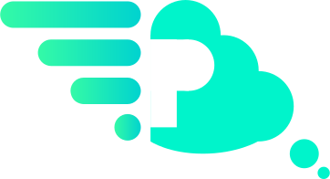
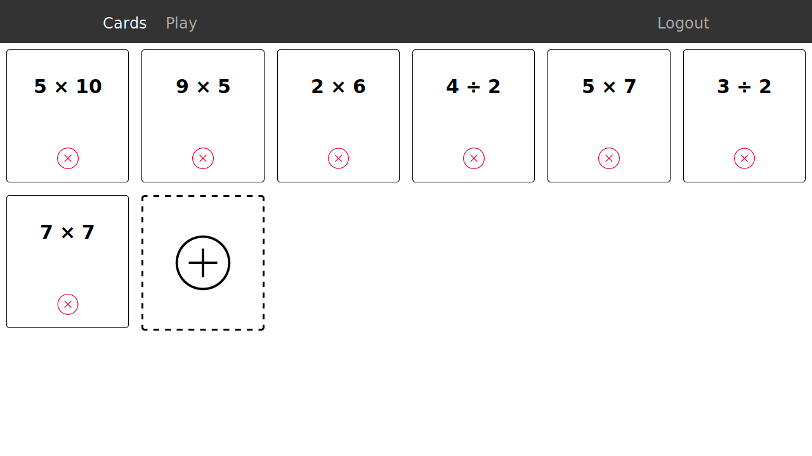
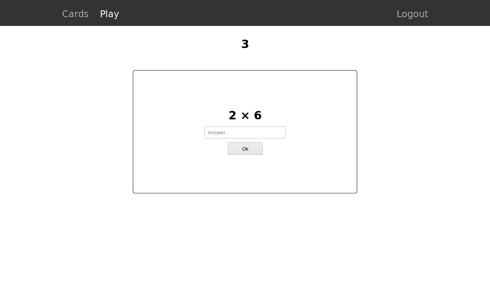

<p align="center">
  <a href="" rel="noopener">
 </a>
</p>

<h3 align="center">Prodigy</h3>

<div align="center">

  []() 
  [](https://github.com/j-chad/prodigy/issues)
  [](https://github.com/j-chad/prodigy/pulls)
  [](/LICENSE)

</div>

---

<p align="center">
    A simple game for learning simple math
    <br> 
</p>

## Table of Contents
- [About](#about)
- [Getting Started](#getting_started)
- [Screenshots](#screenshots)

## About <a name = "about"></a>
This is a **very** basic flashcard web game created as a school assignment.

## Getting Started <a name = "getting_started"></a>
These instructions will get you a copy of the project up and running on your local machine for development and testing purposes.

### Prerequisites
* [Python 3](https://python.org) (tested on python 3.6)

### Installing
Clone this repo
```
git clone https://github.com/j-chad/prodigy
cd prodigy/
```

Install the requirements. It's best to do this in a virtual environment.
```
pip install -r "requirements.txt"
```

### Running
Specify the app with
```
export FLASK_APP="main.py"
```

Initialise the application (you only need to do this once)
```
flask init
```

Run the application
```
flask run
```

## Screenshots <a name="screenshots"></a>


